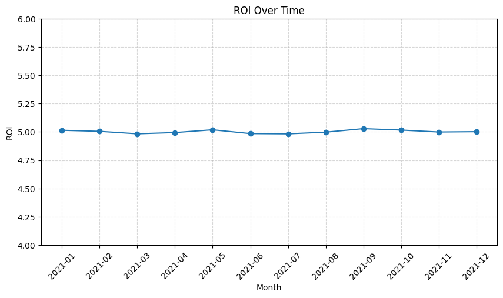
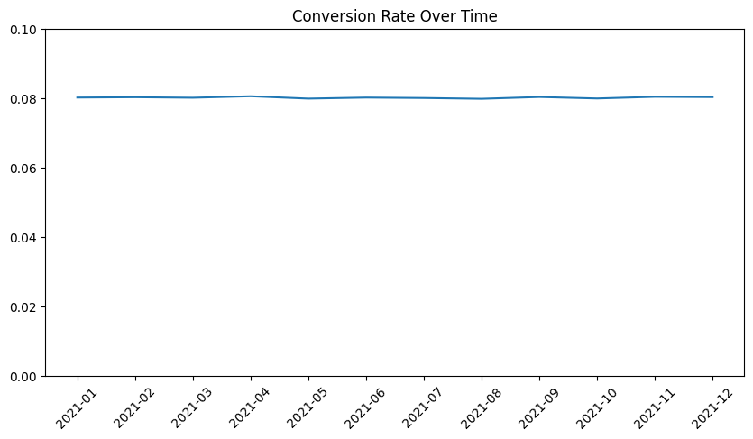
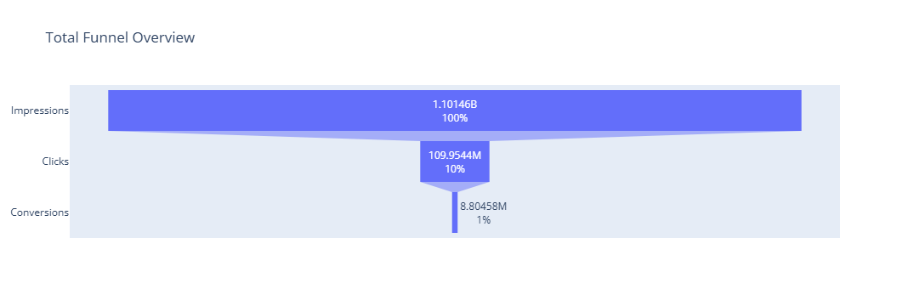
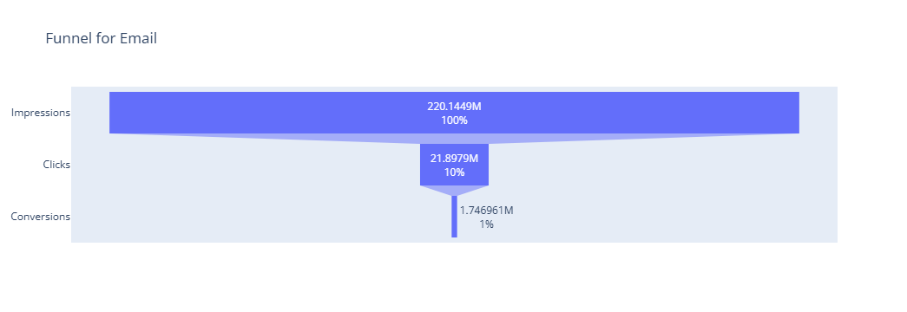
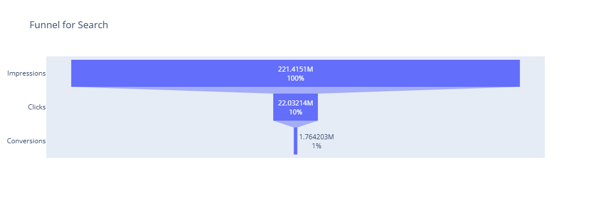
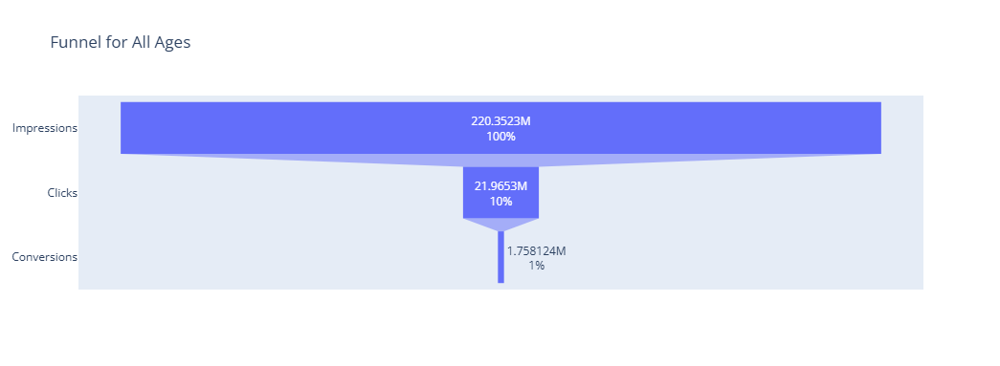
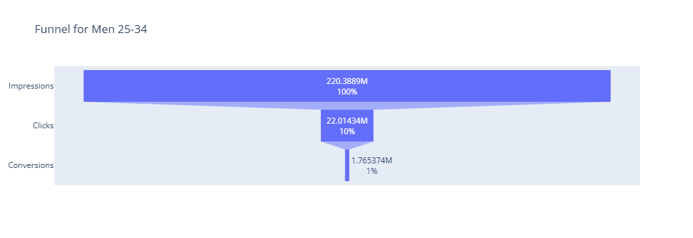
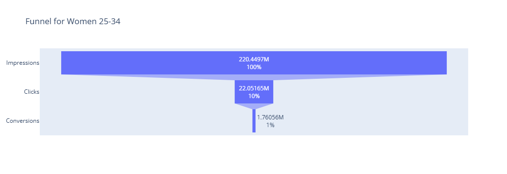

## 1. Problem Defintion
(1) This project aims to evaluate marketing campaign effectiveness by analyzing key performance metrics such as conversion rate, revenue, and ROI.

(2) It focuses on identifying performance differences across marketing channels, campaign characteristics, and audience segments to understand what drives successful campaigns.

(3) The analysis also examines how budget allocation, campaign duration, and targeting strategies influence marketing outcomes and resource efficiency.

(4) The goal is to generate data-driven insights that support channel optimization, audience targeting, and strategic marketing resource allocation.

## 2. Data Review
### 2.1 Description
The Marketing Campaign Performance Dataset provides valuable insights into the effectiveness of various marketing campaigns. This dataset captures the performance metrics, target audience, duration, channels used, and other essential factors that contribute to the success of marketing initiatives. With 200000 unique rows of data spanning two years, this dataset offers a comprehensive view of campaign performance across diverse companies and customer segments.

## 3. Load the CSV file


```python
# Prepare package we need
import pandas as pd
import numpy as np
import matplotlib.pyplot as plt
import plotly.graph_objects as go
```


```python
df = pd.read_csv("C:\\Users\\HW\\Desktop\\Project\\data\\marketing_campaign_dataset.csv")
df
```


<div>
<style scoped>
    .dataframe tbody tr th:only-of-type {
        vertical-align: middle;
    }

    .dataframe tbody tr th {
        vertical-align: top;
    }

    .dataframe thead th {
        text-align: right;
    }
</style>
<table border="1" class="dataframe">
  <thead>
    <tr style="text-align: right;">
      <th></th>
      <th>Campaign_ID</th>
      <th>Company</th>
      <th>Campaign_Type</th>
      <th>Target_Audience</th>
      <th>Duration</th>
      <th>Channel_Used</th>
      <th>Conversion_Rate</th>
      <th>Acquisition_Cost</th>
      <th>ROI</th>
      <th>Location</th>
      <th>Language</th>
      <th>Clicks</th>
      <th>Impressions</th>
      <th>Engagement_Score</th>
      <th>Customer_Segment</th>
      <th>Date</th>
    </tr>
  </thead>
  <tbody>
    <tr>
      <th>0</th>
      <td>1</td>
      <td>Innovate Industries</td>
      <td>Email</td>
      <td>Men 18-24</td>
      <td>30 days</td>
      <td>Google Ads</td>
      <td>0.04</td>
      <td>$16,174.00</td>
      <td>6.29</td>
      <td>Chicago</td>
      <td>Spanish</td>
      <td>506</td>
      <td>1922</td>
      <td>6</td>
      <td>Health &amp; Wellness</td>
      <td>2021-01-01</td>
    </tr>
    <tr>
      <th>1</th>
      <td>2</td>
      <td>NexGen Systems</td>
      <td>Email</td>
      <td>Women 35-44</td>
      <td>60 days</td>
      <td>Google Ads</td>
      <td>0.12</td>
      <td>$11,566.00</td>
      <td>5.61</td>
      <td>New York</td>
      <td>German</td>
      <td>116</td>
      <td>7523</td>
      <td>7</td>
      <td>Fashionistas</td>
      <td>2021-01-02</td>
    </tr>
    <tr>
      <th>2</th>
      <td>3</td>
      <td>Alpha Innovations</td>
      <td>Influencer</td>
      <td>Men 25-34</td>
      <td>30 days</td>
      <td>YouTube</td>
      <td>0.07</td>
      <td>$10,200.00</td>
      <td>7.18</td>
      <td>Los Angeles</td>
      <td>French</td>
      <td>584</td>
      <td>7698</td>
      <td>1</td>
      <td>Outdoor Adventurers</td>
      <td>2021-01-03</td>
    </tr>
    <tr>
      <th>3</th>
      <td>4</td>
      <td>DataTech Solutions</td>
      <td>Display</td>
      <td>All Ages</td>
      <td>60 days</td>
      <td>YouTube</td>
      <td>0.11</td>
      <td>$12,724.00</td>
      <td>5.55</td>
      <td>Miami</td>
      <td>Mandarin</td>
      <td>217</td>
      <td>1820</td>
      <td>7</td>
      <td>Health &amp; Wellness</td>
      <td>2021-01-04</td>
    </tr>
    <tr>
      <th>4</th>
      <td>5</td>
      <td>NexGen Systems</td>
      <td>Email</td>
      <td>Men 25-34</td>
      <td>15 days</td>
      <td>YouTube</td>
      <td>0.05</td>
      <td>$16,452.00</td>
      <td>6.50</td>
      <td>Los Angeles</td>
      <td>Mandarin</td>
      <td>379</td>
      <td>4201</td>
      <td>3</td>
      <td>Health &amp; Wellness</td>
      <td>2021-01-05</td>
    </tr>
    <tr>
      <th>...</th>
      <td>...</td>
      <td>...</td>
      <td>...</td>
      <td>...</td>
      <td>...</td>
      <td>...</td>
      <td>...</td>
      <td>...</td>
      <td>...</td>
      <td>...</td>
      <td>...</td>
      <td>...</td>
      <td>...</td>
      <td>...</td>
      <td>...</td>
      <td>...</td>
    </tr>
    <tr>
      <th>199995</th>
      <td>199996</td>
      <td>TechCorp</td>
      <td>Display</td>
      <td>All Ages</td>
      <td>30 days</td>
      <td>Google Ads</td>
      <td>0.06</td>
      <td>$18,365.00</td>
      <td>2.84</td>
      <td>Chicago</td>
      <td>German</td>
      <td>858</td>
      <td>5988</td>
      <td>1</td>
      <td>Tech Enthusiasts</td>
      <td>2021-12-07</td>
    </tr>
    <tr>
      <th>199996</th>
      <td>199997</td>
      <td>DataTech Solutions</td>
      <td>Email</td>
      <td>Men 25-34</td>
      <td>15 days</td>
      <td>Facebook</td>
      <td>0.02</td>
      <td>$8,168.00</td>
      <td>4.14</td>
      <td>Chicago</td>
      <td>Spanish</td>
      <td>228</td>
      <td>3068</td>
      <td>7</td>
      <td>Foodies</td>
      <td>2021-12-08</td>
    </tr>
    <tr>
      <th>199997</th>
      <td>199998</td>
      <td>DataTech Solutions</td>
      <td>Social Media</td>
      <td>Men 18-24</td>
      <td>45 days</td>
      <td>Website</td>
      <td>0.05</td>
      <td>$13,397.00</td>
      <td>3.25</td>
      <td>New York</td>
      <td>Mandarin</td>
      <td>723</td>
      <td>9548</td>
      <td>3</td>
      <td>Tech Enthusiasts</td>
      <td>2021-12-09</td>
    </tr>
    <tr>
      <th>199998</th>
      <td>199999</td>
      <td>Innovate Industries</td>
      <td>Influencer</td>
      <td>All Ages</td>
      <td>30 days</td>
      <td>YouTube</td>
      <td>0.10</td>
      <td>$18,508.00</td>
      <td>3.86</td>
      <td>Houston</td>
      <td>French</td>
      <td>528</td>
      <td>2763</td>
      <td>1</td>
      <td>Foodies</td>
      <td>2021-12-10</td>
    </tr>
    <tr>
      <th>199999</th>
      <td>200000</td>
      <td>Innovate Industries</td>
      <td>Social Media</td>
      <td>Women 35-44</td>
      <td>45 days</td>
      <td>Google Ads</td>
      <td>0.01</td>
      <td>$13,835.00</td>
      <td>6.64</td>
      <td>Chicago</td>
      <td>Spanish</td>
      <td>924</td>
      <td>7287</td>
      <td>8</td>
      <td>Tech Enthusiasts</td>
      <td>2021-12-11</td>
    </tr>
  </tbody>
</table>
<p>200000 rows × 16 columns</p>
</div>


```python
# Check the type of data, the amount of data
df.info()
df.describe()
```

    <class 'pandas.core.frame.DataFrame'>
    RangeIndex: 200000 entries, 0 to 199999
    Data columns (total 27 columns):
     #   Column             Non-Null Count   Dtype         
    ---  ------             --------------   -----         
     0   Campaign_ID        200000 non-null  int64         
     1   Company            200000 non-null  object        
     2   Campaign_Type      200000 non-null  object        
     3   Target_Audience    200000 non-null  object        
     4   Duration           200000 non-null  object        
     5   Channel_Used       200000 non-null  object        
     6   Conversion_Rate    200000 non-null  float64       
     7   Acquisition_Cost   200000 non-null  object        
     8   ROI                200000 non-null  float64       
     9   Location           200000 non-null  object        
     10  Language           200000 non-null  object        
     11  Clicks             200000 non-null  int64         
     12  Impressions        200000 non-null  int64         
     13  Engagement_Score   200000 non-null  int64         
     14  Customer_Segment   200000 non-null  object        
     15  Date               200000 non-null  datetime64[ns]
     16  Cost               200000 non-null  float64       
     17  Conversions        200000 non-null  float64       
     18  CTR                200000 non-null  float64       
     19  CVR                200000 non-null  float64       
     20  CPA_proxy          200000 non-null  float64       
     21  CPC                200000 non-null  float64       
     22  CPM                200000 non-null  float64       
     23  Month              200000 non-null  period[M]     
     24  CPA                200000 non-null  float64       
     25  Engagement_Level   200000 non-null  category      
     26  ROI_Cost_Category  200000 non-null  object        
    dtypes: category(1), datetime64[ns](1), float64(10), int64(4), object(10), period[M](1)
    memory usage: 39.9+ MB
    


<div>
<style scoped>
    .dataframe tbody tr th:only-of-type {
        vertical-align: middle;
    }

    .dataframe tbody tr th {
        vertical-align: top;
    }

    .dataframe thead th {
        text-align: right;
    }
</style>
<table border="1" class="dataframe">
  <thead>
    <tr style="text-align: right;">
      <th></th>
      <th>Campaign_ID</th>
      <th>Conversion_Rate</th>
      <th>ROI</th>
      <th>Clicks</th>
      <th>Impressions</th>
      <th>Engagement_Score</th>
      <th>Date</th>
      <th>Cost</th>
      <th>Conversions</th>
      <th>CTR</th>
      <th>CVR</th>
      <th>CPA_proxy</th>
      <th>CPC</th>
      <th>CPM</th>
      <th>CPA</th>
    </tr>
  </thead>
  <tbody>
    <tr>
      <th>count</th>
      <td>200000.000000</td>
      <td>200000.000000</td>
      <td>200000.000000</td>
      <td>200000.000000</td>
      <td>200000.000000</td>
      <td>200000.000000</td>
      <td>200000</td>
      <td>200000.000000</td>
      <td>200000.000000</td>
      <td>200000.000000</td>
      <td>200000.000000</td>
      <td>200000.000000</td>
      <td>200000.000000</td>
      <td>200000.000000</td>
      <td>200000.000000</td>
    </tr>
    <tr>
      <th>mean</th>
      <td>100000.500000</td>
      <td>0.080070</td>
      <td>5.002438</td>
      <td>549.772030</td>
      <td>5507.301520</td>
      <td>5.494710</td>
      <td>2021-07-01 23:35:09.600000</td>
      <td>12504.393040</td>
      <td>44.022898</td>
      <td>0.140405</td>
      <td>0.080070</td>
      <td>635.329122</td>
      <td>32.008490</td>
      <td>3.193943</td>
      <td>635.329122</td>
    </tr>
    <tr>
      <th>min</th>
      <td>1.000000</td>
      <td>0.010000</td>
      <td>2.000000</td>
      <td>100.000000</td>
      <td>1000.000000</td>
      <td>1.000000</td>
      <td>2021-01-01 00:00:00</td>
      <td>5000.000000</td>
      <td>1.000000</td>
      <td>0.010054</td>
      <td>0.010000</td>
      <td>34.217755</td>
      <td>5.021084</td>
      <td>0.501401</td>
      <td>34.217755</td>
    </tr>
    <tr>
      <th>25%</th>
      <td>50000.750000</td>
      <td>0.050000</td>
      <td>3.500000</td>
      <td>325.000000</td>
      <td>3266.000000</td>
      <td>3.000000</td>
      <td>2021-04-02 00:00:00</td>
      <td>8739.750000</td>
      <td>17.760000</td>
      <td>0.058606</td>
      <td>0.050000</td>
      <td>180.484192</td>
      <td>15.091967</td>
      <td>1.508453</td>
      <td>180.484192</td>
    </tr>
    <tr>
      <th>50%</th>
      <td>100000.500000</td>
      <td>0.080000</td>
      <td>5.010000</td>
      <td>550.000000</td>
      <td>5517.500000</td>
      <td>5.000000</td>
      <td>2021-07-02 00:00:00</td>
      <td>12496.500000</td>
      <td>35.760000</td>
      <td>0.099789</td>
      <td>0.080000</td>
      <td>334.396247</td>
      <td>22.774008</td>
      <td>2.269956</td>
      <td>334.396247</td>
    </tr>
    <tr>
      <th>75%</th>
      <td>150000.250000</td>
      <td>0.120000</td>
      <td>6.510000</td>
      <td>775.000000</td>
      <td>7753.000000</td>
      <td>8.000000</td>
      <td>2021-10-01 00:00:00</td>
      <td>16264.000000</td>
      <td>64.100000</td>
      <td>0.169699</td>
      <td>0.120000</td>
      <td>692.480613</td>
      <td>38.599088</td>
      <td>3.837796</td>
      <td>692.480613</td>
    </tr>
    <tr>
      <th>max</th>
      <td>200000.000000</td>
      <td>0.150000</td>
      <td>8.000000</td>
      <td>1000.000000</td>
      <td>10000.000000</td>
      <td>10.000000</td>
      <td>2021-12-31 00:00:00</td>
      <td>20000.000000</td>
      <td>150.000000</td>
      <td>0.992024</td>
      <td>0.150000</td>
      <td>19432.352941</td>
      <td>199.960000</td>
      <td>19.896104</td>
      <td>19432.352941</td>
    </tr>
    <tr>
      <th>std</th>
      <td>57735.171256</td>
      <td>0.040602</td>
      <td>1.734488</td>
      <td>260.019056</td>
      <td>2596.864286</td>
      <td>2.872581</td>
      <td>NaN</td>
      <td>4337.664545</td>
      <td>32.317026</td>
      <td>0.130881</td>
      <td>0.040602</td>
      <td>970.140241</td>
      <td>26.926121</td>
      <td>2.698980</td>
      <td>970.140241</td>
    </tr>
  </tbody>
</table>
</div>


## 4. Data Cleaning


```python
# missing value check
df.isnull().sum()
```


    Campaign_ID          0
    Company              0
    Campaign_Type        0
    Target_Audience      0
    Duration             0
    Channel_Used         0
    Conversion_Rate      0
    Acquisition_Cost     0
    ROI                  0
    Location             0
    Language             0
    Clicks               0
    Impressions          0
    Engagement_Score     0
    Customer_Segment     0
    Date                 0
    Cost                 0
    Conversions          0
    CTR                  0
    CVR                  0
    CPA_proxy            0
    CPC                  0
    CPM                  0
    Month                0
    CPA                  0
    Engagement_Level     0
    ROI_Cost_Category    0
    dtype: int64


```python
# handling Outliers
df = df[df["Clicks"] <= df["Impressions"]]
df = df[df["Conversion_Rate"] <= 1]
```


```python
#data type conversion
df["Cost"] = (
    df["Acquisition_Cost"]
    .astype(str)
    .str.replace(r"[^\d.]", "", regex=True)
    .astype(float)
)
```

## 5. Data Analysis

Input Metrics:
    
    Acquisition Cost, Impressions, Duration

Funnel Metrics: 

    Clicks, CTR, CVR(Conversion Rate), Engagement

Output Metrics: 
    
    CVR(Conversion Rate),ROI

Efficiency Metrics:

    CPC = Acquisition Cost / Clicks

    CPA = Acquisition Cost / Conversion

    ROI

We need to calculate these metrics that provide us a structured view of campaign performance across the full marketing lifecycle.
Input metrics know cost and campaign setup, while funnel metrics reveal user behavior and identify where performance drops occur. Output metrics measure the final business impact, such as conversions and ROI, indicating overall campaign success. Efficiency metrics connect cost to outcomes, helping us to relect on past marketing strategy and generate cost-effective strategy.

### 5.1 Key Performance


```python
#1. Conversion
# (1) Calculate the Conversion
df["Conversions"] = df["Clicks"] * df["Conversion_Rate"]
df["Conversions"].mean()
```


    np.float64(44.02289845)


```python
# 2. CTR, CVR, CPA, CPC, CPM
df["CTR"]=df["Clicks"]/df["Impressions"]
df["CVR"]= df["Conversion_Rate"].replace(0, pd.NA)
df["CPA_proxy"]= df["Cost"]/df["Conversions"].replace(0, pd.NA)
df["CPC"]= df["Cost"]/df["Clicks"]
df["CPM"] = df["Cost"] / df["Impressions"]
df[["CTR","CVR","CPC","CPA_proxy","CPM"]].mean()
```


    CTR            0.140405
    CVR            0.080070
    CPC           32.008490
    CPA_proxy    635.329122
    CPM            3.193943
    dtype: float64


### 5.2 Overall Performance Analysis


```python
# 1. ROI Distribution
df["ROI"].describe(),df["ROI"].sum()

```


    (count    200000.000000
     mean          5.002438
     std           1.734488
     min           2.000000
     25%           3.500000
     50%           5.010000
     75%           6.510000
     max           8.000000
     Name: ROI, dtype: float64,
     np.float64(1000487.5700000001))


```python
# 2. Time Trend Analysis
df["Date"] = pd.to_datetime(df["Date"])
df["Month"] = df["Date"].dt.to_period("M")

time_trend = df.groupby("Month").agg({
    "ROI": "mean",
    "Conversion_Rate": "mean",
    "CTR":"mean"
}).reset_index()

time_trend["Month"] = time_trend["Month"].astype(str)

plt.figure(figsize=(10,5))
plt.plot(time_trend["Month"], time_trend["ROI"], marker='o')
plt.title("ROI Over Time")
plt.xlabel("Month")
plt.ylabel("ROI")
plt.ylim(4,6) 
plt.xticks(rotation=45)
plt.grid(True, linestyle='--', alpha=0.5)
plt.show()

plt.figure(figsize=(10,5))
plt.plot(time_trend["Month"], time_trend["CTR"])
plt.xticks(rotation=45)
plt.ylim(0,0.2) 
plt.title("CTR Over Time")
plt.show()


plt.figure(figsize=(10,5))
plt.plot(time_trend["Month"], time_trend["Conversion_Rate"])
plt.xticks(rotation=45)
plt.ylim(0,0.1) 
plt.title("Conversion Rate Over Time")
plt.show()

```


    

    


    

    


    

    


### 5.3 Campaign, Channel，Audience Performance


```python
#1.Check Campaign_Type performance
content_analysis = df.groupby("Campaign_Type").agg({
    "CTR":"mean",
    "CVR":"mean",
    "CPA_proxy":"mean",
    "ROI":"mean",
    "Conversions":"sum"
}).reset_index()

content_analysis
```


<div>
<style scoped>
    .dataframe tbody tr th:only-of-type {
        vertical-align: middle;
    }

    .dataframe tbody tr th {
        vertical-align: top;
    }

    .dataframe thead th {
        text-align: right;
    }
</style>
<table border="1" class="dataframe">
  <thead>
    <tr style="text-align: right;">
      <th></th>
      <th>Campaign_Type</th>
      <th>CTR</th>
      <th>CVR</th>
      <th>CPA_proxy</th>
      <th>ROI</th>
      <th>Conversions</th>
    </tr>
  </thead>
  <tbody>
    <tr>
      <th>0</th>
      <td>Display</td>
      <td>0.141265</td>
      <td>0.080089</td>
      <td>642.058740</td>
      <td>5.006551</td>
      <td>1763752.74</td>
    </tr>
    <tr>
      <th>1</th>
      <td>Email</td>
      <td>0.139489</td>
      <td>0.079788</td>
      <td>638.908653</td>
      <td>4.994295</td>
      <td>1746961.36</td>
    </tr>
    <tr>
      <th>2</th>
      <td>Influencer</td>
      <td>0.140300</td>
      <td>0.080315</td>
      <td>631.671720</td>
      <td>5.011068</td>
      <td>1771218.18</td>
    </tr>
    <tr>
      <th>3</th>
      <td>Search</td>
      <td>0.139936</td>
      <td>0.080021</td>
      <td>634.127350</td>
      <td>5.008357</td>
      <td>1764203.50</td>
    </tr>
    <tr>
      <th>4</th>
      <td>Social Media</td>
      <td>0.141041</td>
      <td>0.080135</td>
      <td>629.888246</td>
      <td>4.991784</td>
      <td>1758443.91</td>
    </tr>
  </tbody>
</table>
</div>


```python
content_analysis.sort_values("Conversions", ascending=False)
```


<div>
<style scoped>
    .dataframe tbody tr th:only-of-type {
        vertical-align: middle;
    }

    .dataframe tbody tr th {
        vertical-align: top;
    }

    .dataframe thead th {
        text-align: right;
    }
</style>
<table border="1" class="dataframe">
  <thead>
    <tr style="text-align: right;">
      <th></th>
      <th>Campaign_Type</th>
      <th>CTR</th>
      <th>CVR</th>
      <th>CPA_proxy</th>
      <th>ROI</th>
      <th>Conversions</th>
    </tr>
  </thead>
  <tbody>
    <tr>
      <th>2</th>
      <td>Influencer</td>
      <td>0.140300</td>
      <td>0.080315</td>
      <td>631.671720</td>
      <td>5.011068</td>
      <td>1771218.18</td>
    </tr>
    <tr>
      <th>3</th>
      <td>Search</td>
      <td>0.139936</td>
      <td>0.080021</td>
      <td>634.127350</td>
      <td>5.008357</td>
      <td>1764203.50</td>
    </tr>
    <tr>
      <th>0</th>
      <td>Display</td>
      <td>0.141265</td>
      <td>0.080089</td>
      <td>642.058740</td>
      <td>5.006551</td>
      <td>1763752.74</td>
    </tr>
    <tr>
      <th>4</th>
      <td>Social Media</td>
      <td>0.141041</td>
      <td>0.080135</td>
      <td>629.888246</td>
      <td>4.991784</td>
      <td>1758443.91</td>
    </tr>
    <tr>
      <th>1</th>
      <td>Email</td>
      <td>0.139489</td>
      <td>0.079788</td>
      <td>638.908653</td>
      <td>4.994295</td>
      <td>1746961.36</td>
    </tr>
  </tbody>
</table>
</div>


```python
# Channel performance
content_analysis_2 = df.groupby("Channel_Used").agg({
    "CTR":"mean",
    "CVR":"mean",
    "CPA_proxy":"mean",
    "ROI":"mean",
    "Conversions":"sum"
}).reset_index()

content_analysis_2
```


<div>
<style scoped>
    .dataframe tbody tr th:only-of-type {
        vertical-align: middle;
    }

    .dataframe tbody tr th {
        vertical-align: top;
    }

    .dataframe thead th {
        text-align: right;
    }
</style>
<table border="1" class="dataframe">
  <thead>
    <tr style="text-align: right;">
      <th></th>
      <th>Channel_Used</th>
      <th>CTR</th>
      <th>CVR</th>
      <th>CPA_proxy</th>
      <th>ROI</th>
      <th>Conversions</th>
    </tr>
  </thead>
  <tbody>
    <tr>
      <th>0</th>
      <td>Email</td>
      <td>0.140543</td>
      <td>0.080282</td>
      <td>632.155023</td>
      <td>4.996487</td>
      <td>1485393.65</td>
    </tr>
    <tr>
      <th>1</th>
      <td>Facebook</td>
      <td>0.140499</td>
      <td>0.079992</td>
      <td>633.808420</td>
      <td>5.018699</td>
      <td>1446290.30</td>
    </tr>
    <tr>
      <th>2</th>
      <td>Google Ads</td>
      <td>0.139190</td>
      <td>0.080183</td>
      <td>642.258667</td>
      <td>5.003141</td>
      <td>1468753.09</td>
    </tr>
    <tr>
      <th>3</th>
      <td>Instagram</td>
      <td>0.140037</td>
      <td>0.079886</td>
      <td>635.751557</td>
      <td>4.988706</td>
      <td>1462864.48</td>
    </tr>
    <tr>
      <th>4</th>
      <td>Website</td>
      <td>0.140971</td>
      <td>0.080183</td>
      <td>632.075453</td>
      <td>5.014167</td>
      <td>1477710.16</td>
    </tr>
    <tr>
      <th>5</th>
      <td>YouTube</td>
      <td>0.141196</td>
      <td>0.079889</td>
      <td>635.906532</td>
      <td>4.993754</td>
      <td>1463568.01</td>
    </tr>
  </tbody>
</table>
</div>


```python
# Customer_Segment performance
content_analysis_3 = df.groupby("Customer_Segment").agg({
    "CTR":"mean",
    "CVR":"mean",
    "CPA_proxy":"mean",
    "ROI":"mean",
    "Conversions":"sum"
}).reset_index()

content_analysis_3
```


<div>
<style scoped>
    .dataframe tbody tr th:only-of-type {
        vertical-align: middle;
    }

    .dataframe tbody tr th {
        vertical-align: top;
    }

    .dataframe thead th {
        text-align: right;
    }
</style>
<table border="1" class="dataframe">
  <thead>
    <tr style="text-align: right;">
      <th></th>
      <th>Customer_Segment</th>
      <th>CTR</th>
      <th>CVR</th>
      <th>CPA_proxy</th>
      <th>ROI</th>
      <th>Conversions</th>
    </tr>
  </thead>
  <tbody>
    <tr>
      <th>0</th>
      <td>Fashionistas</td>
      <td>0.139953</td>
      <td>0.079794</td>
      <td>634.236304</td>
      <td>5.000962</td>
      <td>1744293.84</td>
    </tr>
    <tr>
      <th>1</th>
      <td>Foodies</td>
      <td>0.141413</td>
      <td>0.080257</td>
      <td>638.969105</td>
      <td>5.004376</td>
      <td>1774104.19</td>
    </tr>
    <tr>
      <th>2</th>
      <td>Health &amp; Wellness</td>
      <td>0.139857</td>
      <td>0.079945</td>
      <td>637.512250</td>
      <td>5.003202</td>
      <td>1754118.10</td>
    </tr>
    <tr>
      <th>3</th>
      <td>Outdoor Adventurers</td>
      <td>0.139665</td>
      <td>0.080180</td>
      <td>632.336914</td>
      <td>4.999393</td>
      <td>1767274.79</td>
    </tr>
    <tr>
      <th>4</th>
      <td>Tech Enthusiasts</td>
      <td>0.141127</td>
      <td>0.080168</td>
      <td>633.578605</td>
      <td>5.004234</td>
      <td>1764788.77</td>
    </tr>
  </tbody>
</table>
</div>


```python
# Target Audience performanceA
content_analysis_4 = df.groupby("Target_Audience").agg({
    "CTR":"mean",
    "CVR":"mean",
    "CPA_proxy":"mean",
    "ROI":"mean",
    "Conversions":"sum"
}).reset_index()

content_analysis_4
```


<div>
<style scoped>
    .dataframe tbody tr th:only-of-type {
        vertical-align: middle;
    }

    .dataframe tbody tr th {
        vertical-align: top;
    }

    .dataframe thead th {
        text-align: right;
    }
</style>
<table border="1" class="dataframe">
  <thead>
    <tr style="text-align: right;">
      <th></th>
      <th>Target_Audience</th>
      <th>CTR</th>
      <th>CVR</th>
      <th>CPA_proxy</th>
      <th>ROI</th>
      <th>Conversions</th>
    </tr>
  </thead>
  <tbody>
    <tr>
      <th>0</th>
      <td>All Ages</td>
      <td>0.139802</td>
      <td>0.079975</td>
      <td>637.299368</td>
      <td>5.005174</td>
      <td>1758123.72</td>
    </tr>
    <tr>
      <th>1</th>
      <td>Men 18-24</td>
      <td>0.140483</td>
      <td>0.080240</td>
      <td>633.586021</td>
      <td>4.982853</td>
      <td>1771208.97</td>
    </tr>
    <tr>
      <th>2</th>
      <td>Men 25-34</td>
      <td>0.140134</td>
      <td>0.080132</td>
      <td>636.531713</td>
      <td>5.020627</td>
      <td>1765373.56</td>
    </tr>
    <tr>
      <th>3</th>
      <td>Women 25-34</td>
      <td>0.141031</td>
      <td>0.079899</td>
      <td>633.183719</td>
      <td>4.997351</td>
      <td>1760560.28</td>
    </tr>
    <tr>
      <th>4</th>
      <td>Women 35-44</td>
      <td>0.140579</td>
      <td>0.080102</td>
      <td>636.060828</td>
      <td>5.006330</td>
      <td>1749313.16</td>
    </tr>
  </tbody>
</table>
</div>


```python
# Another method to define a class to analyze
class ContentAnalyzer:
    def __init__(self, df):
        self.df = df

    def group_analysis(self, group_col):
        result = (
            self.df.groupby(group_col)
            .agg({
                "CTR": "mean",
                "CVR": "mean",
                "CPA_proxy": "mean",
                "ROI": "mean",
                "Conversions": "sum"
            })
            .reset_index()
        )
        return result

analyzer = ContentAnalyzer(df)

content_analysis = analyzer.group_analysis("Campaign_Type")
content_analysis_2 = analyzer.group_analysis("Channel_Used")
content_analysis_3 = analyzer.group_analysis("Customer_Segment")
content_analysis_4 = analyzer.group_analysis("Target_Audience")
content_analysis, content_analysis_2,content_analysis_3,content_analysis_4
```


    (  Campaign_Type       CTR       CVR   CPA_proxy       ROI  Conversions
     0       Display  0.141265  0.080089  642.058740  5.006551   1763752.74
     1         Email  0.139489  0.079788  638.908653  4.994295   1746961.36
     2    Influencer  0.140300  0.080315  631.671720  5.011068   1771218.18
     3        Search  0.139936  0.080021  634.127350  5.008357   1764203.50
     4  Social Media  0.141041  0.080135  629.888246  4.991784   1758443.91,
       Channel_Used       CTR       CVR   CPA_proxy       ROI  Conversions
     0        Email  0.140543  0.080282  632.155023  4.996487   1485393.65
     1     Facebook  0.140499  0.079992  633.808420  5.018699   1446290.30
     2   Google Ads  0.139190  0.080183  642.258667  5.003141   1468753.09
     3    Instagram  0.140037  0.079886  635.751557  4.988706   1462864.48
     4      Website  0.140971  0.080183  632.075453  5.014167   1477710.16
     5      YouTube  0.141196  0.079889  635.906532  4.993754   1463568.01,
           Customer_Segment       CTR       CVR   CPA_proxy       ROI  Conversions
     0         Fashionistas  0.139953  0.079794  634.236304  5.000962   1744293.84
     1              Foodies  0.141413  0.080257  638.969105  5.004376   1774104.19
     2    Health & Wellness  0.139857  0.079945  637.512250  5.003202   1754118.10
     3  Outdoor Adventurers  0.139665  0.080180  632.336914  4.999393   1767274.79
     4     Tech Enthusiasts  0.141127  0.080168  633.578605  5.004234   1764788.77,
       Target_Audience       CTR       CVR   CPA_proxy       ROI  Conversions
     0        All Ages  0.139802  0.079975  637.299368  5.005174   1758123.72
     1       Men 18-24  0.140483  0.080240  633.586021  4.982853   1771208.97
     2       Men 25-34  0.140134  0.080132  636.531713  5.020627   1765373.56
     3     Women 25-34  0.141031  0.079899  633.183719  4.997351   1760560.28
     4     Women 35-44  0.140579  0.080102  636.060828  5.006330   1749313.16)


```python
df.groupby("Duration")[["Conversion_Rate","ROI"]].mean()
```


<div>
<style scoped>
    .dataframe tbody tr th:only-of-type {
        vertical-align: middle;
    }

    .dataframe tbody tr th {
        vertical-align: top;
    }

    .dataframe thead th {
        text-align: right;
    }
</style>
<table border="1" class="dataframe">
  <thead>
    <tr style="text-align: right;">
      <th></th>
      <th>Conversion_Rate</th>
      <th>ROI</th>
    </tr>
    <tr>
      <th>Duration</th>
      <th></th>
      <th></th>
    </tr>
  </thead>
  <tbody>
    <tr>
      <th>15 days</th>
      <td>0.080101</td>
      <td>4.996720</td>
    </tr>
    <tr>
      <th>30 days</th>
      <td>0.080177</td>
      <td>5.008887</td>
    </tr>
    <tr>
      <th>45 days</th>
      <td>0.079952</td>
      <td>4.997627</td>
    </tr>
    <tr>
      <th>60 days</th>
      <td>0.080048</td>
      <td>5.006480</td>
    </tr>
  </tbody>
</table>
</div>


### 5.4 Portfolio analysis


```python
# CVR, ROI, and Engagemnet performance of Customer Segment* Campaign_Type 
df.groupby(["Customer_Segment","Campaign_Type"])[["CPA_proxy","ROI","Engagement_Score"]].mean()
```


<div>
<style scoped>
    .dataframe tbody tr th:only-of-type {
        vertical-align: middle;
    }

    .dataframe tbody tr th {
        vertical-align: top;
    }

    .dataframe thead th {
        text-align: right;
    }
</style>
<table border="1" class="dataframe">
  <thead>
    <tr style="text-align: right;">
      <th></th>
      <th></th>
      <th>CPA_proxy</th>
      <th>ROI</th>
      <th>Engagement_Score</th>
    </tr>
    <tr>
      <th>Customer_Segment</th>
      <th>Campaign_Type</th>
      <th></th>
      <th></th>
      <th></th>
    </tr>
  </thead>
  <tbody>
    <tr>
      <th rowspan="5" valign="top">Fashionistas</th>
      <th>Display</th>
      <td>636.337262</td>
      <td>5.010629</td>
      <td>5.490154</td>
    </tr>
    <tr>
      <th>Email</th>
      <td>652.230145</td>
      <td>5.017613</td>
      <td>5.508074</td>
    </tr>
    <tr>
      <th>Influencer</th>
      <td>626.274839</td>
      <td>4.999372</td>
      <td>5.470929</td>
    </tr>
    <tr>
      <th>Search</th>
      <td>623.510923</td>
      <td>4.991934</td>
      <td>5.473724</td>
    </tr>
    <tr>
      <th>Social Media</th>
      <td>633.133637</td>
      <td>4.985792</td>
      <td>5.506771</td>
    </tr>
    <tr>
      <th rowspan="5" valign="top">Foodies</th>
      <th>Display</th>
      <td>645.005907</td>
      <td>5.020454</td>
      <td>5.525213</td>
    </tr>
    <tr>
      <th>Email</th>
      <td>628.162210</td>
      <td>5.000050</td>
      <td>5.519313</td>
    </tr>
    <tr>
      <th>Influencer</th>
      <td>640.414823</td>
      <td>5.016589</td>
      <td>5.526160</td>
    </tr>
    <tr>
      <th>Search</th>
      <td>657.726171</td>
      <td>5.007132</td>
      <td>5.477550</td>
    </tr>
    <tr>
      <th>Social Media</th>
      <td>623.378505</td>
      <td>4.976968</td>
      <td>5.508345</td>
    </tr>
    <tr>
      <th rowspan="5" valign="top">Health &amp; Wellness</th>
      <th>Display</th>
      <td>645.046005</td>
      <td>4.993587</td>
      <td>5.470160</td>
    </tr>
    <tr>
      <th>Email</th>
      <td>637.226780</td>
      <td>4.990531</td>
      <td>5.542746</td>
    </tr>
    <tr>
      <th>Influencer</th>
      <td>639.947600</td>
      <td>5.008931</td>
      <td>5.467484</td>
    </tr>
    <tr>
      <th>Search</th>
      <td>627.236670</td>
      <td>5.027652</td>
      <td>5.436111</td>
    </tr>
    <tr>
      <th>Social Media</th>
      <td>638.202298</td>
      <td>4.994954</td>
      <td>5.505121</td>
    </tr>
    <tr>
      <th rowspan="5" valign="top">Outdoor Adventurers</th>
      <th>Display</th>
      <td>637.881116</td>
      <td>5.016483</td>
      <td>5.549689</td>
    </tr>
    <tr>
      <th>Email</th>
      <td>652.606576</td>
      <td>4.962716</td>
      <td>5.482098</td>
    </tr>
    <tr>
      <th>Influencer</th>
      <td>630.471950</td>
      <td>5.000002</td>
      <td>5.450618</td>
    </tr>
    <tr>
      <th>Search</th>
      <td>619.468106</td>
      <td>5.013732</td>
      <td>5.527757</td>
    </tr>
    <tr>
      <th>Social Media</th>
      <td>621.031541</td>
      <td>5.004172</td>
      <td>5.503420</td>
    </tr>
    <tr>
      <th rowspan="5" valign="top">Tech Enthusiasts</th>
      <th>Display</th>
      <td>645.926767</td>
      <td>4.991033</td>
      <td>5.493038</td>
    </tr>
    <tr>
      <th>Email</th>
      <td>624.481929</td>
      <td>5.001103</td>
      <td>5.446658</td>
    </tr>
    <tr>
      <th>Influencer</th>
      <td>621.253248</td>
      <td>5.030037</td>
      <td>5.499630</td>
    </tr>
    <tr>
      <th>Search</th>
      <td>642.844295</td>
      <td>5.001296</td>
      <td>5.520227</td>
    </tr>
    <tr>
      <th>Social Media</th>
      <td>633.629237</td>
      <td>4.997215</td>
      <td>5.465858</td>
    </tr>
  </tbody>
</table>
</div>


```python
# CVR, ROI, and Engagemnet performance of Target_Audience* Campaign_Type 
df.groupby(["Target_Audience","Campaign_Type"])[["CPA_proxy","ROI","Engagement_Score"]].mean()
```


<div>
<style scoped>
    .dataframe tbody tr th:only-of-type {
        vertical-align: middle;
    }

    .dataframe tbody tr th {
        vertical-align: top;
    }

    .dataframe thead th {
        text-align: right;
    }
</style>
<table border="1" class="dataframe">
  <thead>
    <tr style="text-align: right;">
      <th></th>
      <th></th>
      <th>CPA_proxy</th>
      <th>ROI</th>
      <th>Engagement_Score</th>
    </tr>
    <tr>
      <th>Target_Audience</th>
      <th>Campaign_Type</th>
      <th></th>
      <th></th>
      <th></th>
    </tr>
  </thead>
  <tbody>
    <tr>
      <th rowspan="5" valign="top">All Ages</th>
      <th>Display</th>
      <td>649.469998</td>
      <td>5.016460</td>
      <td>5.498234</td>
    </tr>
    <tr>
      <th>Email</th>
      <td>638.607048</td>
      <td>5.031313</td>
      <td>5.525136</td>
    </tr>
    <tr>
      <th>Influencer</th>
      <td>635.303570</td>
      <td>5.007366</td>
      <td>5.470481</td>
    </tr>
    <tr>
      <th>Search</th>
      <td>618.677834</td>
      <td>4.990011</td>
      <td>5.451071</td>
    </tr>
    <tr>
      <th>Social Media</th>
      <td>644.763614</td>
      <td>4.980952</td>
      <td>5.491805</td>
    </tr>
    <tr>
      <th rowspan="5" valign="top">Men 18-24</th>
      <th>Display</th>
      <td>643.114201</td>
      <td>5.005359</td>
      <td>5.488853</td>
    </tr>
    <tr>
      <th>Email</th>
      <td>631.155731</td>
      <td>4.976120</td>
      <td>5.544933</td>
    </tr>
    <tr>
      <th>Influencer</th>
      <td>644.029557</td>
      <td>4.977951</td>
      <td>5.480293</td>
    </tr>
    <tr>
      <th>Search</th>
      <td>638.070364</td>
      <td>4.995139</td>
      <td>5.525675</td>
    </tr>
    <tr>
      <th>Social Media</th>
      <td>611.094448</td>
      <td>4.959450</td>
      <td>5.536965</td>
    </tr>
    <tr>
      <th rowspan="5" valign="top">Men 25-34</th>
      <th>Display</th>
      <td>637.440713</td>
      <td>4.983207</td>
      <td>5.555948</td>
    </tr>
    <tr>
      <th>Email</th>
      <td>647.717658</td>
      <td>5.013440</td>
      <td>5.447289</td>
    </tr>
    <tr>
      <th>Influencer</th>
      <td>637.141044</td>
      <td>5.018447</td>
      <td>5.494530</td>
    </tr>
    <tr>
      <th>Search</th>
      <td>641.009302</td>
      <td>5.044198</td>
      <td>5.440688</td>
    </tr>
    <tr>
      <th>Social Media</th>
      <td>619.306309</td>
      <td>5.043380</td>
      <td>5.522062</td>
    </tr>
    <tr>
      <th rowspan="5" valign="top">Women 25-34</th>
      <th>Display</th>
      <td>650.773870</td>
      <td>4.991677</td>
      <td>5.495647</td>
    </tr>
    <tr>
      <th>Email</th>
      <td>630.965991</td>
      <td>4.991366</td>
      <td>5.462709</td>
    </tr>
    <tr>
      <th>Influencer</th>
      <td>614.751840</td>
      <td>5.044664</td>
      <td>5.488667</td>
    </tr>
    <tr>
      <th>Search</th>
      <td>626.640005</td>
      <td>4.986857</td>
      <td>5.565201</td>
    </tr>
    <tr>
      <th>Social Media</th>
      <td>642.289391</td>
      <td>4.973634</td>
      <td>5.450795</td>
    </tr>
    <tr>
      <th rowspan="5" valign="top">Women 35-44</th>
      <th>Display</th>
      <td>629.422568</td>
      <td>5.036117</td>
      <td>5.491411</td>
    </tr>
    <tr>
      <th>Email</th>
      <td>646.187705</td>
      <td>4.959973</td>
      <td>5.517908</td>
    </tr>
    <tr>
      <th>Influencer</th>
      <td>626.088818</td>
      <td>5.008438</td>
      <td>5.482047</td>
    </tr>
    <tr>
      <th>Search</th>
      <td>646.366054</td>
      <td>5.025550</td>
      <td>5.452792</td>
    </tr>
    <tr>
      <th>Social Media</th>
      <td>631.924085</td>
      <td>5.001781</td>
      <td>5.488187</td>
    </tr>
  </tbody>
</table>
</div>


```python
# CVR, ROI, and Engagemnet performance of Customer Segment* Channel_Used	
df.groupby(["Customer_Segment","Channel_Used"])[["CPA_proxy","ROI","Engagement_Score"]].mean()
```


<div>
<style scoped>
    .dataframe tbody tr th:only-of-type {
        vertical-align: middle;
    }

    .dataframe tbody tr th {
        vertical-align: top;
    }

    .dataframe thead th {
        text-align: right;
    }
</style>
<table border="1" class="dataframe">
  <thead>
    <tr style="text-align: right;">
      <th></th>
      <th></th>
      <th>CPA_proxy</th>
      <th>ROI</th>
      <th>Engagement_Score</th>
    </tr>
    <tr>
      <th>Customer_Segment</th>
      <th>Channel_Used</th>
      <th></th>
      <th></th>
      <th></th>
    </tr>
  </thead>
  <tbody>
    <tr>
      <th rowspan="6" valign="top">Fashionistas</th>
      <th>Email</th>
      <td>629.762759</td>
      <td>4.987897</td>
      <td>5.503096</td>
    </tr>
    <tr>
      <th>Facebook</th>
      <td>624.479242</td>
      <td>5.004506</td>
      <td>5.535224</td>
    </tr>
    <tr>
      <th>Google Ads</th>
      <td>665.959914</td>
      <td>5.029717</td>
      <td>5.489206</td>
    </tr>
    <tr>
      <th>Instagram</th>
      <td>619.719492</td>
      <td>5.010496</td>
      <td>5.452298</td>
    </tr>
    <tr>
      <th>Website</th>
      <td>640.025624</td>
      <td>5.020863</td>
      <td>5.504268</td>
    </tr>
    <tr>
      <th>YouTube</th>
      <td>624.887193</td>
      <td>4.952345</td>
      <td>5.455840</td>
    </tr>
    <tr>
      <th rowspan="6" valign="top">Foodies</th>
      <th>Email</th>
      <td>636.612825</td>
      <td>4.991678</td>
      <td>5.494288</td>
    </tr>
    <tr>
      <th>Facebook</th>
      <td>636.523742</td>
      <td>5.009666</td>
      <td>5.464340</td>
    </tr>
    <tr>
      <th>Google Ads</th>
      <td>631.390500</td>
      <td>4.969647</td>
      <td>5.525645</td>
    </tr>
    <tr>
      <th>Instagram</th>
      <td>649.685836</td>
      <td>4.998445</td>
      <td>5.512709</td>
    </tr>
    <tr>
      <th>Website</th>
      <td>623.294271</td>
      <td>5.033461</td>
      <td>5.552254</td>
    </tr>
    <tr>
      <th>YouTube</th>
      <td>656.573015</td>
      <td>5.024107</td>
      <td>5.519306</td>
    </tr>
    <tr>
      <th rowspan="6" valign="top">Health &amp; Wellness</th>
      <th>Email</th>
      <td>635.182208</td>
      <td>5.021867</td>
      <td>5.480079</td>
    </tr>
    <tr>
      <th>Facebook</th>
      <td>643.418420</td>
      <td>5.006555</td>
      <td>5.509863</td>
    </tr>
    <tr>
      <th>Google Ads</th>
      <td>644.073885</td>
      <td>5.019812</td>
      <td>5.479642</td>
    </tr>
    <tr>
      <th>Instagram</th>
      <td>642.287435</td>
      <td>4.968776</td>
      <td>5.457645</td>
    </tr>
    <tr>
      <th>Website</th>
      <td>640.497444</td>
      <td>5.014928</td>
      <td>5.466433</td>
    </tr>
    <tr>
      <th>YouTube</th>
      <td>620.031983</td>
      <td>4.987938</td>
      <td>5.510654</td>
    </tr>
    <tr>
      <th rowspan="6" valign="top">Outdoor Adventurers</th>
      <th>Email</th>
      <td>625.662847</td>
      <td>4.970791</td>
      <td>5.454069</td>
    </tr>
    <tr>
      <th>Facebook</th>
      <td>622.018895</td>
      <td>5.022944</td>
      <td>5.494622</td>
    </tr>
    <tr>
      <th>Google Ads</th>
      <td>635.252779</td>
      <td>5.004235</td>
      <td>5.493757</td>
    </tr>
    <tr>
      <th>Instagram</th>
      <td>640.638552</td>
      <td>4.993492</td>
      <td>5.499555</td>
    </tr>
    <tr>
      <th>Website</th>
      <td>625.438246</td>
      <td>5.009121</td>
      <td>5.569502</td>
    </tr>
    <tr>
      <th>YouTube</th>
      <td>644.722194</td>
      <td>4.996338</td>
      <td>5.503961</td>
    </tr>
    <tr>
      <th rowspan="6" valign="top">Tech Enthusiasts</th>
      <th>Email</th>
      <td>633.521418</td>
      <td>5.010684</td>
      <td>5.506975</td>
    </tr>
    <tr>
      <th>Facebook</th>
      <td>642.264389</td>
      <td>5.049569</td>
      <td>5.514964</td>
    </tr>
    <tr>
      <th>Google Ads</th>
      <td>634.484620</td>
      <td>4.992330</td>
      <td>5.481655</td>
    </tr>
    <tr>
      <th>Instagram</th>
      <td>626.217076</td>
      <td>4.972552</td>
      <td>5.522134</td>
    </tr>
    <tr>
      <th>Website</th>
      <td>631.524477</td>
      <td>4.992975</td>
      <td>5.451471</td>
    </tr>
    <tr>
      <th>YouTube</th>
      <td>633.620046</td>
      <td>5.007916</td>
      <td>5.434209</td>
    </tr>
  </tbody>
</table>
</div>


```python
# CVR, ROI, and Engagemnet performance of Customer Segment* Channel_Used	
df.groupby(["Target_Audience","Channel_Used"])[["CPA_proxy","ROI","Engagement_Score"]].mean()
```


<div>
<style scoped>
    .dataframe tbody tr th:only-of-type {
        vertical-align: middle;
    }

    .dataframe tbody tr th {
        vertical-align: top;
    }

    .dataframe thead th {
        text-align: right;
    }
</style>
<table border="1" class="dataframe">
  <thead>
    <tr style="text-align: right;">
      <th></th>
      <th></th>
      <th>CPA_proxy</th>
      <th>ROI</th>
      <th>Engagement_Score</th>
    </tr>
    <tr>
      <th>Target_Audience</th>
      <th>Channel_Used</th>
      <th></th>
      <th></th>
      <th></th>
    </tr>
  </thead>
  <tbody>
    <tr>
      <th rowspan="6" valign="top">All Ages</th>
      <th>Email</th>
      <td>648.030112</td>
      <td>4.963529</td>
      <td>5.481717</td>
    </tr>
    <tr>
      <th>Facebook</th>
      <td>639.041075</td>
      <td>5.033015</td>
      <td>5.472873</td>
    </tr>
    <tr>
      <th>Google Ads</th>
      <td>641.383137</td>
      <td>5.022231</td>
      <td>5.525472</td>
    </tr>
    <tr>
      <th>Instagram</th>
      <td>631.211959</td>
      <td>4.999123</td>
      <td>5.466647</td>
    </tr>
    <tr>
      <th>Website</th>
      <td>629.710647</td>
      <td>5.027339</td>
      <td>5.495260</td>
    </tr>
    <tr>
      <th>YouTube</th>
      <td>634.260465</td>
      <td>4.986596</td>
      <td>5.480547</td>
    </tr>
    <tr>
      <th rowspan="6" valign="top">Men 18-24</th>
      <th>Email</th>
      <td>635.553605</td>
      <td>4.987819</td>
      <td>5.532191</td>
    </tr>
    <tr>
      <th>Facebook</th>
      <td>619.349680</td>
      <td>4.959734</td>
      <td>5.468262</td>
    </tr>
    <tr>
      <th>Google Ads</th>
      <td>641.591794</td>
      <td>5.009151</td>
      <td>5.526585</td>
    </tr>
    <tr>
      <th>Instagram</th>
      <td>630.621050</td>
      <td>4.958137</td>
      <td>5.558184</td>
    </tr>
    <tr>
      <th>Website</th>
      <td>632.816926</td>
      <td>4.998221</td>
      <td>5.526648</td>
    </tr>
    <tr>
      <th>YouTube</th>
      <td>641.720813</td>
      <td>4.984590</td>
      <td>5.478209</td>
    </tr>
    <tr>
      <th rowspan="6" valign="top">Men 25-34</th>
      <th>Email</th>
      <td>626.402416</td>
      <td>5.007358</td>
      <td>5.537313</td>
    </tr>
    <tr>
      <th>Facebook</th>
      <td>634.106473</td>
      <td>5.058776</td>
      <td>5.547840</td>
    </tr>
    <tr>
      <th>Google Ads</th>
      <td>636.710200</td>
      <td>5.030664</td>
      <td>5.447774</td>
    </tr>
    <tr>
      <th>Instagram</th>
      <td>655.122236</td>
      <td>4.993951</td>
      <td>5.438591</td>
    </tr>
    <tr>
      <th>Website</th>
      <td>628.747430</td>
      <td>5.038518</td>
      <td>5.501705</td>
    </tr>
    <tr>
      <th>YouTube</th>
      <td>638.167133</td>
      <td>4.996138</td>
      <td>5.481520</td>
    </tr>
    <tr>
      <th rowspan="6" valign="top">Women 25-34</th>
      <th>Email</th>
      <td>622.379991</td>
      <td>5.009611</td>
      <td>5.441605</td>
    </tr>
    <tr>
      <th>Facebook</th>
      <td>642.991811</td>
      <td>5.010939</td>
      <td>5.502563</td>
    </tr>
    <tr>
      <th>Google Ads</th>
      <td>640.614555</td>
      <td>4.965868</td>
      <td>5.496011</td>
    </tr>
    <tr>
      <th>Instagram</th>
      <td>622.052600</td>
      <td>5.006971</td>
      <td>5.480482</td>
    </tr>
    <tr>
      <th>Website</th>
      <td>630.029918</td>
      <td>4.998791</td>
      <td>5.528148</td>
    </tr>
    <tr>
      <th>YouTube</th>
      <td>641.035374</td>
      <td>4.991960</td>
      <td>5.507017</td>
    </tr>
    <tr>
      <th rowspan="6" valign="top">Women 35-44</th>
      <th>Email</th>
      <td>628.184839</td>
      <td>5.014520</td>
      <td>5.445751</td>
    </tr>
    <tr>
      <th>Facebook</th>
      <td>633.780584</td>
      <td>5.033879</td>
      <td>5.529802</td>
    </tr>
    <tr>
      <th>Google Ads</th>
      <td>651.118881</td>
      <td>4.987042</td>
      <td>5.475361</td>
    </tr>
    <tr>
      <th>Instagram</th>
      <td>639.820287</td>
      <td>4.985893</td>
      <td>5.500075</td>
    </tr>
    <tr>
      <th>Website</th>
      <td>639.242560</td>
      <td>5.007805</td>
      <td>5.492303</td>
    </tr>
    <tr>
      <th>YouTube</th>
      <td>624.155805</td>
      <td>5.009632</td>
      <td>5.477259</td>
    </tr>
  </tbody>
</table>
</div>


```python
# CVR, ROI, and Engagemnet performance of Channel_Used	* Campaign_Type 
df.groupby(["Channel_Used","Campaign_Type"])[["Conversion_Rate","CPA_proxy","ROI","Engagement_Score"]].mean()
```


<div>
<style scoped>
    .dataframe tbody tr th:only-of-type {
        vertical-align: middle;
    }

    .dataframe tbody tr th {
        vertical-align: top;
    }

    .dataframe thead th {
        text-align: right;
    }
</style>
<table border="1" class="dataframe">
  <thead>
    <tr style="text-align: right;">
      <th></th>
      <th></th>
      <th>Conversion_Rate</th>
      <th>CPA_proxy</th>
      <th>ROI</th>
      <th>Engagement_Score</th>
    </tr>
    <tr>
      <th>Channel_Used</th>
      <th>Campaign_Type</th>
      <th></th>
      <th></th>
      <th></th>
      <th></th>
    </tr>
  </thead>
  <tbody>
    <tr>
      <th rowspan="5" valign="top">Email</th>
      <th>Display</th>
      <td>0.080075</td>
      <td>628.220263</td>
      <td>5.030919</td>
      <td>5.532906</td>
    </tr>
    <tr>
      <th>Email</th>
      <td>0.079538</td>
      <td>640.455323</td>
      <td>5.002873</td>
      <td>5.520710</td>
    </tr>
    <tr>
      <th>Influencer</th>
      <td>0.081245</td>
      <td>628.325482</td>
      <td>4.990573</td>
      <td>5.455211</td>
    </tr>
    <tr>
      <th>Search</th>
      <td>0.079949</td>
      <td>645.493767</td>
      <td>4.973491</td>
      <td>5.482138</td>
    </tr>
    <tr>
      <th>Social Media</th>
      <td>0.080607</td>
      <td>618.215330</td>
      <td>4.984613</td>
      <td>5.448081</td>
    </tr>
    <tr>
      <th rowspan="5" valign="top">Facebook</th>
      <th>Display</th>
      <td>0.079925</td>
      <td>632.695186</td>
      <td>5.001037</td>
      <td>5.526252</td>
    </tr>
    <tr>
      <th>Email</th>
      <td>0.079859</td>
      <td>637.870586</td>
      <td>5.011501</td>
      <td>5.450448</td>
    </tr>
    <tr>
      <th>Influencer</th>
      <td>0.080154</td>
      <td>640.955555</td>
      <td>5.026686</td>
      <td>5.513439</td>
    </tr>
    <tr>
      <th>Search</th>
      <td>0.080268</td>
      <td>629.913513</td>
      <td>5.033110</td>
      <td>5.516184</td>
    </tr>
    <tr>
      <th>Social Media</th>
      <td>0.079758</td>
      <td>627.576865</td>
      <td>5.021544</td>
      <td>5.512336</td>
    </tr>
    <tr>
      <th rowspan="5" valign="top">Google Ads</th>
      <th>Display</th>
      <td>0.079977</td>
      <td>655.074774</td>
      <td>5.003464</td>
      <td>5.517147</td>
    </tr>
    <tr>
      <th>Email</th>
      <td>0.080111</td>
      <td>645.616014</td>
      <td>5.011126</td>
      <td>5.496337</td>
    </tr>
    <tr>
      <th>Influencer</th>
      <td>0.080334</td>
      <td>635.968230</td>
      <td>5.002175</td>
      <td>5.455648</td>
    </tr>
    <tr>
      <th>Search</th>
      <td>0.080604</td>
      <td>625.921677</td>
      <td>5.005131</td>
      <td>5.488393</td>
    </tr>
    <tr>
      <th>Social Media</th>
      <td>0.079883</td>
      <td>649.062809</td>
      <td>4.993798</td>
      <td>5.513558</td>
    </tr>
    <tr>
      <th rowspan="5" valign="top">Instagram</th>
      <th>Display</th>
      <td>0.079957</td>
      <td>645.654303</td>
      <td>4.970192</td>
      <td>5.466835</td>
    </tr>
    <tr>
      <th>Email</th>
      <td>0.079986</td>
      <td>628.218025</td>
      <td>4.991200</td>
      <td>5.553765</td>
    </tr>
    <tr>
      <th>Influencer</th>
      <td>0.079868</td>
      <td>635.022326</td>
      <td>4.997622</td>
      <td>5.483967</td>
    </tr>
    <tr>
      <th>Search</th>
      <td>0.079763</td>
      <td>636.820116</td>
      <td>5.007164</td>
      <td>5.475615</td>
    </tr>
    <tr>
      <th>Social Media</th>
      <td>0.079858</td>
      <td>632.943281</td>
      <td>4.977553</td>
      <td>5.465437</td>
    </tr>
    <tr>
      <th rowspan="5" valign="top">Website</th>
      <th>Display</th>
      <td>0.080445</td>
      <td>645.566096</td>
      <td>5.030686</td>
      <td>5.533223</td>
    </tr>
    <tr>
      <th>Email</th>
      <td>0.079941</td>
      <td>633.404666</td>
      <td>4.991408</td>
      <td>5.456966</td>
    </tr>
    <tr>
      <th>Influencer</th>
      <td>0.080230</td>
      <td>618.602421</td>
      <td>5.025426</td>
      <td>5.481955</td>
    </tr>
    <tr>
      <th>Search</th>
      <td>0.079919</td>
      <td>633.101913</td>
      <td>5.031826</td>
      <td>5.494130</td>
    </tr>
    <tr>
      <th>Social Media</th>
      <td>0.080391</td>
      <td>629.702639</td>
      <td>4.990506</td>
      <td>5.579355</td>
    </tr>
    <tr>
      <th rowspan="5" valign="top">YouTube</th>
      <th>Display</th>
      <td>0.080153</td>
      <td>645.274350</td>
      <td>5.003317</td>
      <td>5.459982</td>
    </tr>
    <tr>
      <th>Email</th>
      <td>0.079292</td>
      <td>647.857356</td>
      <td>4.957175</td>
      <td>5.518766</td>
    </tr>
    <tr>
      <th>Influencer</th>
      <td>0.080058</td>
      <td>631.214331</td>
      <td>5.024395</td>
      <td>5.509228</td>
    </tr>
    <tr>
      <th>Search</th>
      <td>0.079629</td>
      <td>633.436072</td>
      <td>4.999608</td>
      <td>5.466985</td>
    </tr>
    <tr>
      <th>Social Media</th>
      <td>0.080307</td>
      <td>621.790553</td>
      <td>4.983104</td>
      <td>5.469956</td>
    </tr>
  </tbody>
</table>
</div>


## 6. Funnel analysis


```python
# Overall funnel metrics analysis
funnel = {
    "Impressions": df["Impressions"].sum(),
    "Clicks": df["Clicks"].sum(),
    "Conversions": df["Conversions"].sum()
}

funnel["CTR"] = funnel["Clicks"] / funnel["Impressions"]
funnel["CVR"] = funnel["Conversions"] / funnel["Clicks"]
funnel["Dropoff_Impressions_to_Clicks"] = 1 - funnel["CTR"]
funnel["Dropoff_Clicks_to_Conversions"] = 1 - funnel["CVR"]
funnel["Dropoff_Impressions_to_Conversions"] = 1 - funnel["Conversions"] / funnel["Impressions"]

funnel
```


    {'Impressions': np.int64(1101460304),
     'Clicks': np.int64(109954406),
     'Conversions': np.float64(8804579.69),
     'CTR': np.float64(0.09982602695775408),
     'CVR': np.float64(0.08007482383197995),
     'Dropoff_Impressions_to_Clicks': np.float64(0.9001739730422459),
     'Dropoff_Clicks_to_Conversions': np.float64(0.91992517616802),
     'Dropoff_Impressions_to_Conversions': np.float64(0.9920064484775114)}


```python
# Plot for overall funnel metrics analysis
funnel_values = [df["Impressions"].sum(), df["Clicks"].sum(), df["Conversions"].sum()]
funnel_labels = ["Impressions", "Clicks", "Conversions"]

fig = go.Figure(go.Funnel(
    y=funnel_labels,
    x=funnel_values,
    textinfo="value+percent initial"
))

fig.update_layout(title="Total Funnel Overview")
fig.show()
```


    

    


```python
# Totals by Campaign_Type
funnel_by_type = df.groupby("Campaign_Type")[["Impressions","Clicks","Conversions"]].sum()

# Campaign_Type funnel metrics
funnel_by_type["CTR"] = funnel_by_type["Clicks"] / funnel_by_type["Impressions"]
funnel_by_type["CVR"] = funnel_by_type["Conversions"] / funnel_by_type["Clicks"]
funnel_by_type["Dropoff_Impressions_to_Clicks"] = 1 - funnel_by_type["CTR"]
funnel_by_type["Dropoff_Clicks_to_Conversions"] = 1 - funnel_by_type["CVR"]
funnel_by_type["Dropoff_Impressions_to_Conversions"] = 1 - funnel_by_type["Conversions"] / funnel_by_type["Impressions"]

funnel_by_type
```


<div>
<style scoped>
    .dataframe tbody tr th:only-of-type {
        vertical-align: middle;
    }

    .dataframe tbody tr th {
        vertical-align: top;
    }

    .dataframe thead th {
        text-align: right;
    }
</style>
<table border="1" class="dataframe">
  <thead>
    <tr style="text-align: right;">
      <th></th>
      <th>Impressions</th>
      <th>Clicks</th>
      <th>Conversions</th>
      <th>CTR</th>
      <th>CVR</th>
      <th>Dropoff_Impressions_to_Clicks</th>
      <th>Dropoff_Clicks_to_Conversions</th>
      <th>Dropoff_Impressions_to_Conversions</th>
    </tr>
    <tr>
      <th>Campaign_Type</th>
      <th></th>
      <th></th>
      <th></th>
      <th></th>
      <th></th>
      <th></th>
      <th></th>
      <th></th>
    </tr>
  </thead>
  <tbody>
    <tr>
      <th>Display</th>
      <td>220074756</td>
      <td>22030979</td>
      <td>1763752.74</td>
      <td>0.100107</td>
      <td>0.080058</td>
      <td>0.899893</td>
      <td>0.919942</td>
      <td>0.991986</td>
    </tr>
    <tr>
      <th>Email</th>
      <td>220144927</td>
      <td>21897902</td>
      <td>1746961.36</td>
      <td>0.099470</td>
      <td>0.079778</td>
      <td>0.900530</td>
      <td>0.920222</td>
      <td>0.992064</td>
    </tr>
    <tr>
      <th>Influencer</th>
      <td>220769081</td>
      <td>22037657</td>
      <td>1771218.18</td>
      <td>0.099822</td>
      <td>0.080372</td>
      <td>0.900178</td>
      <td>0.919628</td>
      <td>0.991977</td>
    </tr>
    <tr>
      <th>Search</th>
      <td>221415139</td>
      <td>22032144</td>
      <td>1764203.50</td>
      <td>0.099506</td>
      <td>0.080074</td>
      <td>0.900494</td>
      <td>0.919926</td>
      <td>0.992032</td>
    </tr>
    <tr>
      <th>Social Media</th>
      <td>219056401</td>
      <td>21955724</td>
      <td>1758443.91</td>
      <td>0.100229</td>
      <td>0.080090</td>
      <td>0.899771</td>
      <td>0.919910</td>
      <td>0.991973</td>
    </tr>
  </tbody>
</table>
</div>


```python
#Plots for funnel metrics of Campaign_Type
funnel_by_type = df.groupby("Campaign_Type")[["Impressions","Clicks","Conversions"]].sum()

for campaign in funnel_by_type.index:
    values = funnel_by_type.loc[campaign, ["Impressions","Clicks","Conversions"]].values
    fig = go.Figure(go.Funnel(
        y=["Impressions","Clicks","Conversions"],
        x=values,
        textinfo="value+percent initial"
    ))
    fig.update_layout(title=f"Funnel for {campaign}")
    fig.show()
```


    

    


    

    


    

    


    

    


    

    


```python
# Totals by Customer Segment
funnel_by_segment = df.groupby("Customer_Segment")[["Impressions","Clicks","Conversions"]].sum()

# Customer Segment funnel metrics
funnel_by_segment["CTR"] = funnel_by_segment["Clicks"] / funnel_by_segment["Impressions"]
funnel_by_segment["CVR"] = funnel_by_segment["Conversions"] / funnel_by_segment["Clicks"]
funnel_by_segment["Dropoff_Impressions_to_Clicks"] = 1 - funnel_by_segment["CTR"]
funnel_by_segment["Dropoff_Clicks_to_Conversions"] = 1 - funnel_by_segment["CVR"]
funnel_by_segment["Dropoff_Impressions_to_Conversions"] = 1 - funnel_by_segment["Conversions"] / funnel_by_segment["Impressions"]

funnel_by_segment
```


<div>
<style scoped>
    .dataframe tbody tr th:only-of-type {
        vertical-align: middle;
    }

    .dataframe tbody tr th {
        vertical-align: top;
    }

    .dataframe thead th {
        text-align: right;
    }
</style>
<table border="1" class="dataframe">
  <thead>
    <tr style="text-align: right;">
      <th></th>
      <th>Impressions</th>
      <th>Clicks</th>
      <th>Conversions</th>
      <th>CTR</th>
      <th>CVR</th>
      <th>Dropoff_Impressions_to_Clicks</th>
      <th>Dropoff_Clicks_to_Conversions</th>
      <th>Dropoff_Impressions_to_Conversions</th>
    </tr>
    <tr>
      <th>Customer_Segment</th>
      <th></th>
      <th></th>
      <th></th>
      <th></th>
      <th></th>
      <th></th>
      <th></th>
      <th></th>
    </tr>
  </thead>
  <tbody>
    <tr>
      <th>Fashionistas</th>
      <td>219253627</td>
      <td>21855164</td>
      <td>1744293.84</td>
      <td>0.099680</td>
      <td>0.079812</td>
      <td>0.900320</td>
      <td>0.920188</td>
      <td>0.992044</td>
    </tr>
    <tr>
      <th>Foodies</th>
      <td>220815116</td>
      <td>22080774</td>
      <td>1774104.19</td>
      <td>0.099997</td>
      <td>0.080346</td>
      <td>0.900003</td>
      <td>0.919654</td>
      <td>0.991966</td>
    </tr>
    <tr>
      <th>Health &amp; Wellness</th>
      <td>220457458</td>
      <td>21953923</td>
      <td>1754118.10</td>
      <td>0.099583</td>
      <td>0.079900</td>
      <td>0.900417</td>
      <td>0.920100</td>
      <td>0.992043</td>
    </tr>
    <tr>
      <th>Outdoor Adventurers</th>
      <td>220548859</td>
      <td>22028553</td>
      <td>1767274.79</td>
      <td>0.099881</td>
      <td>0.080227</td>
      <td>0.900119</td>
      <td>0.919773</td>
      <td>0.991987</td>
    </tr>
    <tr>
      <th>Tech Enthusiasts</th>
      <td>220385244</td>
      <td>22035992</td>
      <td>1764788.77</td>
      <td>0.099989</td>
      <td>0.080087</td>
      <td>0.900011</td>
      <td>0.919913</td>
      <td>0.991992</td>
    </tr>
  </tbody>
</table>
</div>


```python
# Totals by Customer Segment
funnel_by_segment = df.groupby("Channel_Used")[["Impressions","Clicks","Conversions"]].sum()

# Customer Segment funnel metrics
funnel_by_segment["CTR"] = funnel_by_segment["Clicks"] / funnel_by_segment["Impressions"]
funnel_by_segment["CVR"] = funnel_by_segment["Conversions"] / funnel_by_segment["Clicks"]
funnel_by_segment["Dropoff_Impressions_to_Clicks"] = 1 - funnel_by_segment["CTR"]
funnel_by_segment["Dropoff_Clicks_to_Conversions"] = 1 - funnel_by_segment["CVR"]
funnel_by_segment["Dropoff_Impressions_to_Conversions"] = 1 - funnel_by_segment["Conversions"] / funnel_by_segment["Impressions"]

funnel_by_segment
```


<div>
<style scoped>
    .dataframe tbody tr th:only-of-type {
        vertical-align: middle;
    }

    .dataframe tbody tr th {
        vertical-align: top;
    }

    .dataframe thead th {
        text-align: right;
    }
</style>
<table border="1" class="dataframe">
  <thead>
    <tr style="text-align: right;">
      <th></th>
      <th>Impressions</th>
      <th>Clicks</th>
      <th>Conversions</th>
      <th>CTR</th>
      <th>CVR</th>
      <th>Dropoff_Impressions_to_Clicks</th>
      <th>Dropoff_Clicks_to_Conversions</th>
      <th>Dropoff_Impressions_to_Conversions</th>
    </tr>
    <tr>
      <th>Channel_Used</th>
      <th></th>
      <th></th>
      <th></th>
      <th></th>
      <th></th>
      <th></th>
      <th></th>
      <th></th>
    </tr>
  </thead>
  <tbody>
    <tr>
      <th>Email</th>
      <td>184801107</td>
      <td>18493963</td>
      <td>1485393.65</td>
      <td>0.100075</td>
      <td>0.080318</td>
      <td>0.899925</td>
      <td>0.919682</td>
      <td>0.991962</td>
    </tr>
    <tr>
      <th>Facebook</th>
      <td>180659428</td>
      <td>18037947</td>
      <td>1446290.30</td>
      <td>0.099845</td>
      <td>0.080180</td>
      <td>0.900155</td>
      <td>0.919820</td>
      <td>0.991994</td>
    </tr>
    <tr>
      <th>Google Ads</th>
      <td>185006879</td>
      <td>18340807</td>
      <td>1468753.09</td>
      <td>0.099136</td>
      <td>0.080081</td>
      <td>0.900864</td>
      <td>0.919919</td>
      <td>0.992061</td>
    </tr>
    <tr>
      <th>Instagram</th>
      <td>183738455</td>
      <td>18316654</td>
      <td>1462864.48</td>
      <td>0.099689</td>
      <td>0.079865</td>
      <td>0.900311</td>
      <td>0.920135</td>
      <td>0.992038</td>
    </tr>
    <tr>
      <th>Website</th>
      <td>183806353</td>
      <td>18414628</td>
      <td>1477710.16</td>
      <td>0.100185</td>
      <td>0.080247</td>
      <td>0.899815</td>
      <td>0.919753</td>
      <td>0.991961</td>
    </tr>
    <tr>
      <th>YouTube</th>
      <td>183448082</td>
      <td>18350407</td>
      <td>1463568.01</td>
      <td>0.100031</td>
      <td>0.079757</td>
      <td>0.899969</td>
      <td>0.920243</td>
      <td>0.992022</td>
    </tr>
  </tbody>
</table>
</div>


```python
# Totals by Customer Segment
funnel_by_segment = df.groupby("Channel_Used")[["Impressions","Clicks","Conversions"]].sum()

# Customer Segment funnel metrics
funnel_by_segment["CTR"] = funnel_by_segment["Clicks"] / funnel_by_segment["Impressions"]
funnel_by_segment["CVR"] = funnel_by_segment["Conversions"] / funnel_by_segment["Clicks"]
funnel_by_segment["Dropoff_Impressions_to_Clicks"] = 1 - funnel_by_segment["CTR"]
funnel_by_segment["Dropoff_Clicks_to_Conversions"] = 1 - funnel_by_segment["CVR"]
funnel_by_segment["Dropoff_Impressions_to_Conversions"] = 1 - funnel_by_segment["Conversions"] / funnel_by_segment["Impressions"]

funnel_by_segment
```


<div>
<style scoped>
    .dataframe tbody tr th:only-of-type {
        vertical-align: middle;
    }

    .dataframe tbody tr th {
        vertical-align: top;
    }

    .dataframe thead th {
        text-align: right;
    }
</style>
<table border="1" class="dataframe">
  <thead>
    <tr style="text-align: right;">
      <th></th>
      <th>Impressions</th>
      <th>Clicks</th>
      <th>Conversions</th>
      <th>CTR</th>
      <th>CVR</th>
      <th>Dropoff_Impressions_to_Clicks</th>
      <th>Dropoff_Clicks_to_Conversions</th>
      <th>Dropoff_Impressions_to_Conversions</th>
    </tr>
    <tr>
      <th>Channel_Used</th>
      <th></th>
      <th></th>
      <th></th>
      <th></th>
      <th></th>
      <th></th>
      <th></th>
      <th></th>
    </tr>
  </thead>
  <tbody>
    <tr>
      <th>Email</th>
      <td>184801107</td>
      <td>18493963</td>
      <td>1485393.65</td>
      <td>0.100075</td>
      <td>0.080318</td>
      <td>0.899925</td>
      <td>0.919682</td>
      <td>0.991962</td>
    </tr>
    <tr>
      <th>Facebook</th>
      <td>180659428</td>
      <td>18037947</td>
      <td>1446290.30</td>
      <td>0.099845</td>
      <td>0.080180</td>
      <td>0.900155</td>
      <td>0.919820</td>
      <td>0.991994</td>
    </tr>
    <tr>
      <th>Google Ads</th>
      <td>185006879</td>
      <td>18340807</td>
      <td>1468753.09</td>
      <td>0.099136</td>
      <td>0.080081</td>
      <td>0.900864</td>
      <td>0.919919</td>
      <td>0.992061</td>
    </tr>
    <tr>
      <th>Instagram</th>
      <td>183738455</td>
      <td>18316654</td>
      <td>1462864.48</td>
      <td>0.099689</td>
      <td>0.079865</td>
      <td>0.900311</td>
      <td>0.920135</td>
      <td>0.992038</td>
    </tr>
    <tr>
      <th>Website</th>
      <td>183806353</td>
      <td>18414628</td>
      <td>1477710.16</td>
      <td>0.100185</td>
      <td>0.080247</td>
      <td>0.899815</td>
      <td>0.919753</td>
      <td>0.991961</td>
    </tr>
    <tr>
      <th>YouTube</th>
      <td>183448082</td>
      <td>18350407</td>
      <td>1463568.01</td>
      <td>0.100031</td>
      <td>0.079757</td>
      <td>0.899969</td>
      <td>0.920243</td>
      <td>0.992022</td>
    </tr>
  </tbody>
</table>
</div>


```python
# Totals by Customer Segment
funnel_by_segment = df.groupby("Target_Audience")[["Impressions","Clicks","Conversions"]].sum()

# Customer Segment funnel metrics
funnel_by_segment["CTR"] = funnel_by_segment["Clicks"] / funnel_by_segment["Impressions"]
funnel_by_segment["CVR"] = funnel_by_segment["Conversions"] / funnel_by_segment["Clicks"]
funnel_by_segment["Dropoff_Impressions_to_Clicks"] = 1 - funnel_by_segment["CTR"]
funnel_by_segment["Dropoff_Clicks_to_Conversions"] = 1 - funnel_by_segment["CVR"]
funnel_by_segment["Dropoff_Impressions_to_Conversions"] = 1 - funnel_by_segment["Conversions"] / funnel_by_segment["Impressions"]

funnel_by_segment
```


<div>
<style scoped>
    .dataframe tbody tr th:only-of-type {
        vertical-align: middle;
    }

    .dataframe tbody tr th {
        vertical-align: top;
    }

    .dataframe thead th {
        text-align: right;
    }
</style>
<table border="1" class="dataframe">
  <thead>
    <tr style="text-align: right;">
      <th></th>
      <th>Impressions</th>
      <th>Clicks</th>
      <th>Conversions</th>
      <th>CTR</th>
      <th>CVR</th>
      <th>Dropoff_Impressions_to_Clicks</th>
      <th>Dropoff_Clicks_to_Conversions</th>
      <th>Dropoff_Impressions_to_Conversions</th>
    </tr>
    <tr>
      <th>Target_Audience</th>
      <th></th>
      <th></th>
      <th></th>
      <th></th>
      <th></th>
      <th></th>
      <th></th>
      <th></th>
    </tr>
  </thead>
  <tbody>
    <tr>
      <th>All Ages</th>
      <td>220352342</td>
      <td>21965301</td>
      <td>1758123.72</td>
      <td>0.099683</td>
      <td>0.080041</td>
      <td>0.900317</td>
      <td>0.919959</td>
      <td>0.992021</td>
    </tr>
    <tr>
      <th>Men 18-24</th>
      <td>221226637</td>
      <td>22096802</td>
      <td>1771208.97</td>
      <td>0.099883</td>
      <td>0.080157</td>
      <td>0.900117</td>
      <td>0.919843</td>
      <td>0.991994</td>
    </tr>
    <tr>
      <th>Men 25-34</th>
      <td>220388856</td>
      <td>22014338</td>
      <td>1765373.56</td>
      <td>0.099889</td>
      <td>0.080192</td>
      <td>0.900111</td>
      <td>0.919808</td>
      <td>0.991990</td>
    </tr>
    <tr>
      <th>Women 25-34</th>
      <td>220449734</td>
      <td>22051647</td>
      <td>1760560.28</td>
      <td>0.100030</td>
      <td>0.079838</td>
      <td>0.899970</td>
      <td>0.920162</td>
      <td>0.992014</td>
    </tr>
    <tr>
      <th>Women 35-44</th>
      <td>219042735</td>
      <td>21826318</td>
      <td>1749313.16</td>
      <td>0.099644</td>
      <td>0.080147</td>
      <td>0.900356</td>
      <td>0.919853</td>
      <td>0.992014</td>
    </tr>
  </tbody>
</table>
</div>


```python
#Plots for funnel metrics of Customer Segment
funnel_by_type = df.groupby("Target_Audience")[["Impressions","Clicks","Conversions"]].sum()

for campaign in funnel_by_type.index:
    values = funnel_by_type.loc[campaign, ["Impressions","Clicks","Conversions"]].values
    fig = go.Figure(go.Funnel(
        y=["Impressions","Clicks","Conversions"],
        x=values,
        textinfo="value+percent initial"
    ))
    fig.update_layout(title=f"Funnel for {campaign}")
    fig.show()
```


    

    


    

    


    

    


    

    


    

    


## 7. Effectiveness Analysis


```python
# The degree of user interaction after watching ads
df["Engagement_Score"].describe()
```


    count    200000.000000
    mean          5.494710
    std           2.872581
    min           1.000000
    25%           3.000000
    50%           5.000000
    75%           8.000000
    max          10.000000
    Name: Engagement_Score, dtype: float64


```python
# The correlation between engagement and CTR,ROI,CVR
df[["Engagement_Score", "CTR","ROI"]].corr()
```


<div>
<style scoped>
    .dataframe tbody tr th:only-of-type {
        vertical-align: middle;
    }

    .dataframe tbody tr th {
        vertical-align: top;
    }

    .dataframe thead th {
        text-align: right;
    }
</style>
<table border="1" class="dataframe">
  <thead>
    <tr style="text-align: right;">
      <th></th>
      <th>Engagement_Score</th>
      <th>CTR</th>
      <th>ROI</th>
    </tr>
  </thead>
  <tbody>
    <tr>
      <th>Engagement_Score</th>
      <td>1.000000</td>
      <td>-0.005747</td>
      <td>0.000588</td>
    </tr>
    <tr>
      <th>CTR</th>
      <td>-0.005747</td>
      <td>1.000000</td>
      <td>-0.002116</td>
    </tr>
    <tr>
      <th>ROI</th>
      <td>0.000588</td>
      <td>-0.002116</td>
      <td>1.000000</td>
    </tr>
  </tbody>
</table>
</div>


```python
#Campaign_Type × Engagement_Level
#Find the combination of high Engagement + high ROI.
bins = [0, 4, 7, 10]  
labels = ["Low", "Medium", "High"]
df["Engagement_Level"] = pd.cut(df["Engagement_Score"], bins=bins, labels=labels, include_lowest=True)


roi_pivot = df.pivot_table(
    index="Campaign_Type",
    columns="Engagement_Level",
    values="ROI",
    aggfunc="mean"
).round(3)

roi_pivot
```

    C:\Users\HW\AppData\Local\Temp\ipykernel_34148\2047850075.py:8: FutureWarning:
    
    The default value of observed=False is deprecated and will change to observed=True in a future version of pandas. Specify observed=False to silence this warning and retain the current behavior
    
    


<div>
<style scoped>
    .dataframe tbody tr th:only-of-type {
        vertical-align: middle;
    }

    .dataframe tbody tr th {
        vertical-align: top;
    }

    .dataframe thead th {
        text-align: right;
    }
</style>
<table border="1" class="dataframe">
  <thead>
    <tr style="text-align: right;">
      <th>Engagement_Level</th>
      <th>Low</th>
      <th>Medium</th>
      <th>High</th>
    </tr>
    <tr>
      <th>Campaign_Type</th>
      <th></th>
      <th></th>
      <th></th>
    </tr>
  </thead>
  <tbody>
    <tr>
      <th>Display</th>
      <td>4.989</td>
      <td>5.011</td>
      <td>5.025</td>
    </tr>
    <tr>
      <th>Email</th>
      <td>4.995</td>
      <td>4.997</td>
      <td>4.990</td>
    </tr>
    <tr>
      <th>Influencer</th>
      <td>5.013</td>
      <td>4.998</td>
      <td>5.021</td>
    </tr>
    <tr>
      <th>Search</th>
      <td>5.011</td>
      <td>5.014</td>
      <td>4.999</td>
    </tr>
    <tr>
      <th>Social Media</th>
      <td>4.993</td>
      <td>5.000</td>
      <td>4.981</td>
    </tr>
  </tbody>
</table>
</div>


```python
# ROI vs Cost
roi_median = df['ROI'].median()
cost_median = df['Cost'].median()

def roi_cost_category(row):
    if row['ROI'] >= roi_median and row['Cost'] <= cost_median:
        return 'High ROI + Low Cost (Opportunity)'
    elif row['ROI'] < roi_median and row['Cost'] > cost_median:
        return 'Low ROI + High Cost (Waste)'
    else:
        return 'Normal'

df['ROI_Cost_Category'] = df.apply(roi_cost_category, axis=1)

category_summary = df.groupby('ROI_Cost_Category')[['ROI','Cost']].mean().round(3)
category_summary
```


<div>
<style scoped>
    .dataframe tbody tr th:only-of-type {
        vertical-align: middle;
    }

    .dataframe tbody tr th {
        vertical-align: top;
    }

    .dataframe thead th {
        text-align: right;
    }
</style>
<table border="1" class="dataframe">
  <thead>
    <tr style="text-align: right;">
      <th></th>
      <th>ROI</th>
      <th>Cost</th>
    </tr>
    <tr>
      <th>ROI_Cost_Category</th>
      <th></th>
      <th></th>
    </tr>
  </thead>
  <tbody>
    <tr>
      <th>High ROI + Low Cost (Opportunity)</th>
      <td>6.498</td>
      <td>8748.065</td>
    </tr>
    <tr>
      <th>Low ROI + High Cost (Waste)</th>
      <td>3.501</td>
      <td>16249.988</td>
    </tr>
    <tr>
      <th>Normal</th>
      <td>5.004</td>
      <td>12511.847</td>
    </tr>
  </tbody>
</table>
</div>


```python
# Budget Allocation Simulation
print(df['Cost'].sum())

# Current ROI
baseline_roi_weighted = (df['ROI'] * df['Cost']).sum() / df['Cost'].sum()
print(f"Current weighted ROI: {current_roi_weighted:.3f}")

# Low ROI High Cost & High ROI Low Cost
low_roi_high_cost = df[df['ROI_Cost_Category']=='Low ROI + High Cost (Waste)']
high_roi_low_cost = df[df['ROI_Cost_Category']=='High ROI + Low Cost (Opportunity)']
budget_to_reallocate = low_roi_high_cost['Cost'].sum()

# Mean ROI of High ROI Low Cost
target_roi = (high_roi_low_cost['ROI'] * high_roi_low_cost['Cost']).sum() / high_roi_low_cost['Cost'].sum()

# New ROI contribution after reallocation
new_total_roi = (df['ROI'] * df['Cost']).sum() - (low_roi_high_cost['ROI'] * low_roi_high_cost['Cost']).sum() \
                + (budget_to_reallocate * target_roi)

new_weighted_roi = new_total_roi / total_budget
print(f"New weighted ROI after reallocation: {new_weighted_roi:.3f}")

# Gain on baseline ROI
roi_gain = new_weighted_roi - current_roi_weighted
print(f"Simulated ROI gain: {roi_gain:.3f}")
```

    2500878608.0
    Current weighted ROI: 5.005
    New weighted ROI after reallocating budget: 5.977
    Simulated ROI gain: 0.971
    


```python
# Top 10% ROI with Campaign_Type, Customer_Segment, Channel_Used, Engagement_Score
roi_90 = df['ROI'].quantile(0.9)
top10_roi_campaigns = df[df['ROI'] >= roi_90]
print(len(top10_roi_campaigns))


top10_roi_campaigns[['Campaign_Type','Customer_Segment','Channel_Used','Engagement_Score','ROI']].head()
```

    20252
    


<div>
<style scoped>
    .dataframe tbody tr th:only-of-type {
        vertical-align: middle;
    }

    .dataframe tbody tr th {
        vertical-align: top;
    }

    .dataframe thead th {
        text-align: right;
    }
</style>
<table border="1" class="dataframe">
  <thead>
    <tr style="text-align: right;">
      <th></th>
      <th>Campaign_Type</th>
      <th>Customer_Segment</th>
      <th>Channel_Used</th>
      <th>Engagement_Score</th>
      <th>ROI</th>
    </tr>
  </thead>
  <tbody>
    <tr>
      <th>20</th>
      <td>Search</td>
      <td>Outdoor Adventurers</td>
      <td>Email</td>
      <td>3</td>
      <td>7.99</td>
    </tr>
    <tr>
      <th>34</th>
      <td>Influencer</td>
      <td>Fashionistas</td>
      <td>YouTube</td>
      <td>6</td>
      <td>7.81</td>
    </tr>
    <tr>
      <th>46</th>
      <td>Search</td>
      <td>Foodies</td>
      <td>YouTube</td>
      <td>3</td>
      <td>7.40</td>
    </tr>
    <tr>
      <th>52</th>
      <td>Email</td>
      <td>Tech Enthusiasts</td>
      <td>Facebook</td>
      <td>6</td>
      <td>7.62</td>
    </tr>
    <tr>
      <th>64</th>
      <td>Display</td>
      <td>Fashionistas</td>
      <td>Website</td>
      <td>9</td>
      <td>7.43</td>
    </tr>
  </tbody>
</table>
</div>


```python
# Top 10% ROI Campaign, Customer, Engagement Patterns 
campaign_type_pattern = top10_roi_campaigns['Campaign_Type'].value_counts(normalize=True)

segment_pattern = top10_roi_campaigns['Customer_Segment'].value_counts(normalize=True)

channel_pattern = top10_roi_campaigns['Channel_Used'].value_counts(normalize=True)

engagement_pattern = top10_roi_campaigns['Engagement_Score'].describe().round(2)

print("=== Top 10% ROI Campaign Patterns ===\n")
print("Campaign Type Distribution:")
print(campaign_type_pattern)
print("\nCustomer Segment Distribution:")
print(segment_pattern)
print("\nChannel Distribution:")
print(channel_pattern)
print("\nEngagement Score Summary:")
print(engagement_pattern)
```

    === Top 10% ROI Campaign Patterns ===
    
    Campaign Type Distribution:
    Campaign_Type
    Search          0.206844
    Influencer      0.201067
    Social Media    0.198598
    Display         0.198153
    Email           0.195339
    Name: proportion, dtype: float64
    
    Customer Segment Distribution:
    Customer_Segment
    Tech Enthusiasts       0.202400
    Fashionistas           0.200968
    Foodies                0.200128
    Outdoor Adventurers    0.198598
    Health & Wellness      0.197906
    Name: proportion, dtype: float64
    
    Channel Distribution:
    Channel_Used
    Google Ads    0.168922
    Facebook      0.167934
    Email         0.166551
    Website       0.166255
    Instagram     0.165811
    YouTube       0.164527
    Name: proportion, dtype: float64
    
    Engagement Score Summary:
    count    20252.00
    mean         5.48
    std          2.87
    min          1.00
    25%          3.00
    50%          5.00
    75%          8.00
    max         10.00
    Name: Engagement_Score, dtype: float64
    
